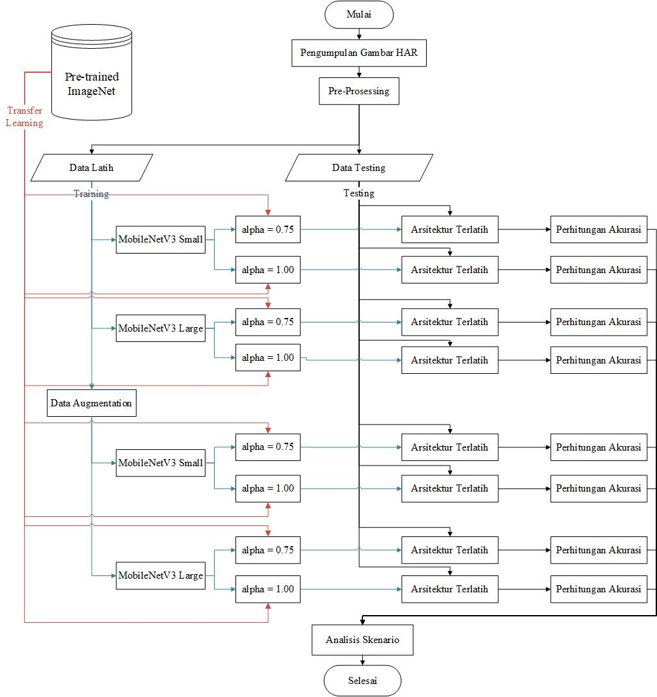

# Klasifikasi-Gambar-Aktivitas-Manusia
ini merupakan penelitian yang saya lakukan saat menempu pendidikan S1 - Ilmu Komputer, penelitian ini saya lakukan untuk menyelesaikan tugas akhir pada tahun 2023. pada kesempatan ini saya membuat model deep learning dengan menggunakan arsitektur ***MobileNet V3 small*** dan ***Large***, untuk mengklasifikasi gambar dari **15 aktivitas manusia**.

model akan dilatih dengan skenario seperti gambar dibawah :

