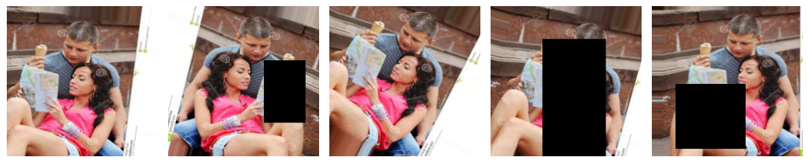

# Klasifikasi-Gambar-Aktivitas-Manusia
Ini merupakan penelitian yang saya lakukan saat menempu pendidikan S1 - Ilmu Komputer, penelitian ini saya lakukan untuk menyelesaikan tugas akhir pada tahun 2023. pada kesempatan ini saya membuat model deep learning dengan menggunakan arsitektur ***MobileNet V3 small*** dan ***Large***, untuk mengklasifikasi gambar dari **15 aktivitas manusia**.

model akan dilatih dengan skenario seperti gambar dibawah :


## Dataset Penelitian
Dataset yang digunakan pada penelitian kali ini adalah berupa gambar aktivitas manusia yang terdiri dari **15 kelas** aktivitas dengan total keseluruhan gambar sebanyak **18000** gambar, dimana masing masing kelas memiliki **1200** gambar

dataset dapat di lihat pada [website kaggle.com](https://www.kaggle.com/datasets/emirhanai/human-action-detection-artificial-intelligence)

untuk gambaran mendetail mengenai dataset dapat dilihat dibawah:

| Dataset properti | informasi |
| ------------ | --- |
| Jumlah Kelas | 15 |
| Data latih/kelas | 1000 |
| Data uji/kelas | 200 |
| Total data latih | 15000 |
| Total data uji | 3000 |
| Total gambar | 18000 |
| Sumber | https://www.kaggle.com/datasets/emirhanai/human-action-detection-artificial-intelligence |
| Format | .jpg |
| Size terbesar | 26 KB |
| Size terkecil | 2 KB |
| Size dataset | 142 MB |
| Ukuran terbesar | 400x126 pixel |
| Ukuran terkecil | 95x84 pixel |

untuk kelas-kelas yang terdapat pada dataset ini dapat dilihat di table bawah:

| kelas | data latih | data test | total gambar|
|-------|------------|-----------|-------------|
| calling | 1000 | 200 | 1200 |
| clapping | 1000 | 200 | 1200 |
| cycling | 1000 | 200 | 1200 |
| dancing | 1000 | 200 | 1200 |
| drinking | 1000 | 200 | 1200 |
| eating | 1000 | 200 | 1200 |
| fighting | 1000 | 200 | 1200 |
| hugging | 1000 | 200 | 1200 |
| laughing | 1000 | 200 | 1200 |
| listening to music | 1000 | 200 | 1200 |
| running | 1000 | 200 | 1200 |
| sitting | 1000 | 200 | 1200 |
| sleeping | 1000 | 200 | 1200 |
| texting | 1000 | 200 | 1200 |
| using a | 1000 | 200 | 1200 |
| **Total Gambar** | **15000** | **3000** | **18000** |

## Pre-processing
Proses preprocessing bertujuan untuk menyamaratakan data sehingga semua data memiliki format yang sama untuk dimasukan kedalam model.
beberapa proses pre-processing yang digunakan kali ini adalah :
### resize
dimana semua gambar akan diubah ukuran menjadi 224x224 pixel, dimana teknik resize yang digunakan adalah [bilinear interpolation](https://en.wikipedia.org/wiki/Bilinear_interpolation)

sebenarnya kita dapat memilih teknik resize yang kita mau, [resize pada tensorflow](https://www.tensorflow.org/api_docs/python/tf/image/resize) sendiri menyediakan beberapa teknik resize seperti :
- AREA	'area'
- BICUBIC	'bicubic'
- BILINEAR	'bilinear'
- GAUSSIAN	'gaussian'
- LANCZOS3	'lanczos3'
- LANCZOS5	'lanczos5'
- MITCHELLCUBIC	'mitchellcubic'
- NEAREST_NEIGHBOR	'nearest'

dan kita dapat ubah dengan
```
tf.image.resize(
    images, 
    size, 
    method=ResizeMethod.BILINEAR, // ganti metode yang di inginkan di sini
    preserve_aspect_ratio=False,
    antialias=False,
    name=None
)
```
## Data Augmentation
Untuk mengatasi overfitting saya menggunakan data augmentation agar data yang digunakan selama proses pelatihan lebih beragam. teknik ini sering digunakan dibanyak penelitian dan merupakan cara paling ampuh untuk mengatasi dataset yang sedikit dan kurang keberagaman. beberapa teknik ini dapat digunakan dengan [ImageDataGenerator pada TensorFlow](https://www.tensorflow.org/api_docs/python/tf/keras/preprocessing/image/ImageDataGenerator) sedangkan untuk random cutout merupakan teknik tambahan (sampai saat respatori ini dibuat belum ada pada tansorflow)

pada kesempatan ini beberapa teknik augmentasi yang digunakan antara lain:
- random rotate dengan besar 30 derajat, 
- random flip (horizontal dan vertical), 
- shear(kemiringan), 
- fill (mengisi ruang kosong) dengan nearest neighbor, 
- [random cutout (melubangi gambar secara random)](https://github.com/yu4u/cutout-random-erasing).

berikut contoh data yang telah melalui data augmentation :


## Transfer Learning
Akan lebih mudah mengajari seseorang yang memilii pengetahuan dasar untuk mengerjakan tugas spesific, hal ini juga berlaku pada model Deep Learning. Transfer Learning memungkinkan kita untuk mengunakan pengatahuan yang diperoleh dari pelatihan sebelumnya ke dalam model baru sehingga dari pada membiarkan model belajar dari null, setidaknya model memiliki pengetahuan dasar mengenai pola dan bentuk. 
model pada percobaan ini akan mendapatkan transfer pengetahuan dari pelatihan sebelumnya yang dimana pelatihan tersebut dilakukan pada dataset [ImageNet](https://www.image-net.org/about.php) yang merupakan dataset besar dengan 1000 kelas.

kita dapat mengunakan teknik ini pada [Tensorflow saat mendeklarasikan model](https://www.tensorflow.org/api_docs/python/tf/keras/applications/MobileNetV3Large)
```
tf.keras.applications.MobileNetV3Large(
    input_shape=None,
    alpha=1.0,
    # disini untuk menetukan apakah jenis learning yang dinginkan
    #'none' untuk tidak menggunakan teknik
    # atau masukan path weight file yang ingin digunakan
    weights='imagenet',
    classes=1000,
    pooling=None,
    classifier_activation='softmax',
)
```

##
